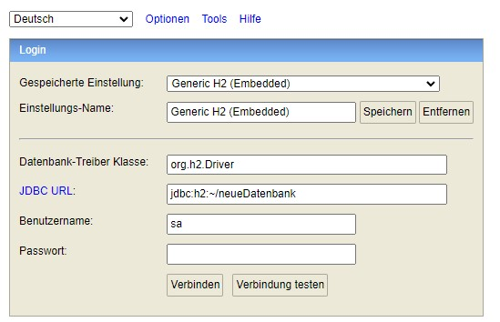
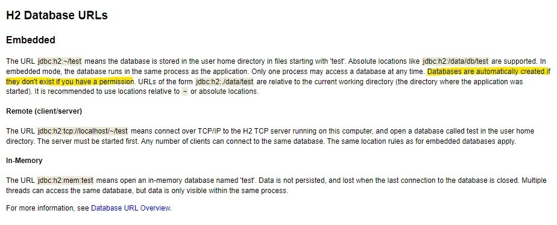
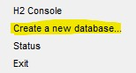
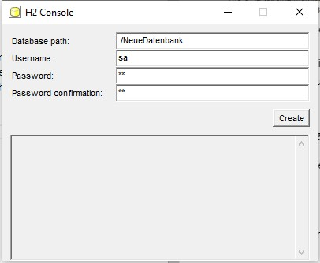

# Anlage einer neuen/zweiten Datenbank für u.a. den KanbanReportingService
Um die Eigenschaften von Microservice der Eigenständigkeit zu gewährleisten ist eine eigene Datenhaltung notwendig. Hierfür wird eine eigene Datenbank benötigt, hier H2. H2 ermöglicht weitere eingebettete Datenbanken anzulegen, die unabhängig zu den bisherigen betrieben werden kann. Im nachfolgenden wird die Installation und Verbindung in der Konsole beschrieben. Außerdem wird die Einrichtung dessen für den KanbanReportingService kurz erläutert.

## 1	Anlage der neuen Datenbank
Hierfür muss beginnend die „H2 Console“ gestartet werden. Daraufhin gibt es zwei Optionen für die Anlage einer neuen Datenbank, über die Console selbst oder via Taskleiste im Kontextmenü des H2 Database Engine. Im Folgenden werden beide Möglichkeiten der Vollständigkeit halber beschrieben. 

### 1.1	Anlage via H2 Console 
Die Verbindung zu einer Datenbank, die nicht existiert legt diese an, solange die Berechtigungen vorhanden sind. Im Folgenden ist dies zu erkennen (ebenso wie die Erläuterung von H2). 
 

Und die Erläuterungen: 

Nachdem nun „Verbinden“ gewählt wurde legt H2 automatisch die Datenbank an, wenn nicht vorhanden. Diese ist per Standard im Verzeichnis des Benutzers zu finden mit den Änderungen „.mv.db“. Diese kann nun für den Dienst eingerichtet und dann verwendet werden. 

### 1.2	Anlage via Taskleiste H2 Database Engine
Eine weitere etwas verstecktere und andere Möglichkeit, eine neue Datenbank anzulegen ist über die (in Windows) Taskleiste.
 

Auf diesem Logo kann via Rechtsklick das Kontextmenü geöffnet werden, wo nun die Option für "Create a new database..." vorhanden ist (siehe folgendes Bild). 

Wenn dieses gewählt wird ist die folgende Maske sichtbar, in der sowohl Dateipfad und Name der neuen Datenbank gewählt werden kann, als auch Super-Admin User. Ebenso findet hier eine bessere Fehlerprüfung und Rückmeldung statt. Im Nachfolgenden ist die Maske und eine mögliche Eingabe zu erkennen:

Folgend wurde die Datenbank angelegt. Nun kann via H2 Console wie regulär drauf verbunden werden. Dazu muss lediglich der neue Datenbanknamen korrekt im JDBC URL Feld eingetragen werden.

## 2 Ausführung des DB Skriptes für den jeweiligen Dienst

Natürlich ist es möglich, für beide Dienste eine neue individuell benammte Datenbank anzulegen, falls die initiale "test" Datenbank bereits in Verwendung ist. Vorgehen ist in Schritt 1 und 2 gleich nur das eben der DB Name anders gesetzt wird bzw. ein anderes DB Skript ausgeführt wird (welches für den Betrieb der DB für den zu installiereden Dienst benötigt wird). Im Folgenden die Ausführung, welches Skript welcher Dienst benötigt:

- KanbandmanagementService: **"/SQL Skripte/Init Skript KanbanmanagementService.sql"**
- KanbanboardReportingService: **"/SQL Skripte/Init Skript KanbanReportingService.sql"**

Diese müssen entsprechend in der H2 Konsole ausgeführt werden. Achtung: Es werden hierbei Testdatensätze angelegt, wenn diese nicht gewünscht sind, müssen entsprechende *Insert*-Befehle auskommentiert werden. 

Die Skripte wurden extra so entworfen, dass sie mehrfach ausgeführt werden können ohne zum Absturz zu führen.