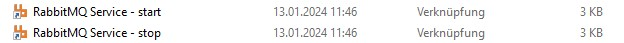
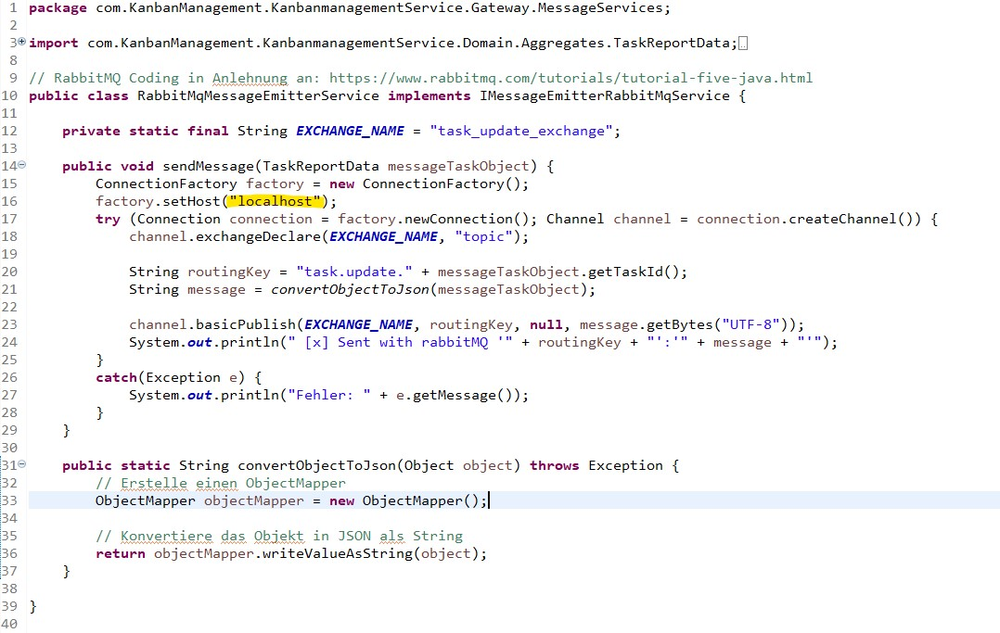
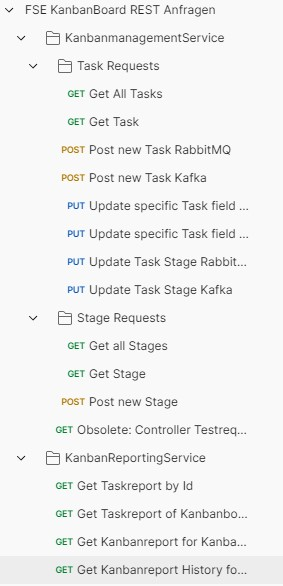

MWI 104 Fortgeschrittene Softwareentwicklung: Projekt Gruppe 2 Kanban
============== 
*Gerne diese Datei (**README.md**) direkt im Dateibaum auswählen und anschauen, da dort mehr Text in einer Zeile dargestellt werden kann, ist möglicherweise übersichtlicher.*

# Inhaltsverzeichnis
- [MWI 104 Fortgeschrittene Softwareentwicklung: Projekt Gruppe 2 Kanban](#mwi-104-fortgeschrittene-softwareentwicklung-projekt-gruppe-2-kanban)
- [Inhaltsverzeichnis](#inhaltsverzeichnis)
- [Einführung](#einführung)
- [Hinweise zur Verwendung des Repositories](#hinweise-zur-verwendung-des-repositories)
  - [Start der beiden Microservices *(... und was noch dazugehört)*](#start-der-beiden-microservices--und-was-noch-dazugehört)
    - [**H2-Datenbank**](#h2-datenbank)
    - [**Kafka** (hier am Beispiel von Zookeeper, Achtung Reihenfolge wichtig!)](#kafka-hier-am-beispiel-von-zookeeper-achtung-reihenfolge-wichtig)
    - [Start der **Microservices** (Reihenfolge nicht relevant)](#start-der-microservices-reihenfolge-nicht-relevant)
  - [Notwendige Konfigurationsschritte](#notwendige-konfigurationsschritte)
    - [Konfiguration von RabbitMQ](#konfiguration-von-rabbitmq)
    - [Konfiguration von Kafka](#konfiguration-von-kafka)
    - [Konfiguration der H2-Datenbanken](#konfiguration-der-h2-datenbanken)
      - [Anlage (zweiter) Datenbank](#anlage-zweiter-datenbank)
      - [Initialisierung der Datenstrukturen und Daten](#initialisierung-der-datenstrukturen-und-daten)
      - [Anpassung der Application.Properties](#anpassung-der-applicationproperties)
    - [Import Rest-Anfragen via Postman Collection](#import-rest-anfragen-via-postman-collection)
    - [(Optional) Anpassung des Server Ports (nicht empfohlen)](#optional-anpassung-des-server-ports-nicht-empfohlen)
  - [Notwendige Installationen](#notwendige-installationen)
    - [Installation der Java SDK (17) und Maven](#installation-der-java-sdk-17-und-maven)
    - [Installation von RabbitMQ](#installation-von-rabbitmq)
    - [Installation von Kafka](#installation-von-kafka)
    - [Installation der H2 Datenbank](#installation-der-h2-datenbank)
    - [Installation von Postman (optional)](#installation-von-postman-optional)


# Einführung
Das vorliegende GitHub Repository ist die Projektbearbeitung der Gruppe 2 im Kurs MWI 104 Fortgeschrittene Softwareentwicklung mit der Themenstellung Kanban. Es handelt sich hierbei und zwei Microservices, die einen geeigneten Kontext abbilden und hier mittels Spring-Boot implementiert sind. Dabei nutzen sie verschiedenste Elemente aus der Veranstaltung, wie RabbitMQ und Kafka, Paradigmen der Softwarearchitektur (wie die Onion-Architektur, Ports and Adapter..) sowie Unit Tests.

Im Nachfolgenden werden ein paar Hinweise Verwendung des Repositories gegeben, hinsichtlich der Einrichtung und des Testens. Hier wird teilweise auf weitere Anleitungen im ../Commands/ Verzeichnis verwiesen.

**Bei Fragen gerne an die Autoren des Repositories wenden oder über einen Kommentar GitHub-Projekt.**

# Hinweise zur Verwendung des Repositories
In diesem Kapitel werden die notwendigen Konfigurations-, Installations- und Startschritte sowie das Testing beschrieben, um das Projekt zu verwenden. Hierbei wurde die Installation (obwohl sie im logischen Ablauf zuerst durchgeführt werden sollte) zuletzt aufgeführt, da Konfigurationsschritte sowie Startanweisungen zum einfachen Wiederfinden  direkt vorangehend besser sind.  

## Start der beiden Microservices *(... und was noch dazugehört)* 

Nachfolgend eine einfache Auflistung der "Dinge", die "gestartet" werden müssen, wobei hier die Microservices zuletzt gestartet werden sollten.

### **H2-Datenbank** 
(Sollte automatisch durch die Dienste gestartet werden, wenn nicht, dann [*java -jar h2*.jar, h2.bat, oder h2.sh*](https://www.h2database.com/html/cheatSheet.html#:~:text=To%20start%20the%20H2%20Console,an%20embedded%20URL%20is%20used.) ausführen)
- **RabbitMQ** (Sollte auch automatisch gestartet werden, sonst [rabbitmq-server start -detached](https://stackoverflow.com/questions/47242282/how-do-i-start-a-rabbitmq-node) oder via Windows Verknüpfung im Startmenü von Windows (siehe Bild))

### **Kafka** (hier am Beispiel von Zookeeper, Achtung Reihenfolge wichtig!)
    
  1. Kommandozeile im Kafka Installationsverzeichnis starten (bspw. C:\kafka)
  2. Folgenden Command zum Starten von Zookeeper:
  ```
  .\bin\windows\zookeeper-server-start.bat .\config\zookeeper.properties
  ```
  1. Folgenden Command zum Starten von Kafka:
  ```
  .\bin\windows\kafka-server-start.bat .\config\server.properties
  ```

### Start der **Microservices** (Reihenfolge nicht relevant) 
 * Kommandozeile im Projektverzeichnis starten und folgenden Command ausführen ([Quelle](https://docs.spring.io/spring-boot/docs/1.5.16.RELEASE/reference/html/using-boot-running-your-application.html)):

 ```
 mvn spring-boot:run
 ```
 
 * Achtung: Das Projektverzeichnis sind die Verzeichnisse, in welchen sich die pom.xml befindet, also:
 ```
 .\MWI-104-Fortgeschrittene-Softwareentwicklung-Gruppe2-Kanban\KanbanmanagementService\KanbanmanagementService
 ```
 für den **KanbanmanagementService** und 
 ```
 .\MWI-104-Fortgeschrittene-Softwareentwicklung-Gruppe2-Kanban\KanbanReportingService\KanbanReportingService
 ```
 für den **KanbanReportingService**.


Daraufhin können die Dienste verwendet werden, hierzu kann Postman und die Collection herangezogen werden, in welcher bereits vordefinierte Rest-Anfragen für die Endpoints der beiden Microservices vorliegen, die auch direkt mit den initialen Daten funktionieren.

Hinweis für das Testen: Das Logging des Ablaufs ist an kritischen Stellen ausführlicher gewählt worden, um über die Konsole schnell und einfach nachvollziehen zu können, was in dem jeweiligen Dienst passiert. 

* * * * * * * * * *
## Notwendige Konfigurationsschritte
### Konfiguration von RabbitMQ
Für den Einsatz von RabbitMQ muss optional der Server-Name im Coding in beiden Projekten angepasst werden, wenn dieser nachträglich verändert worden ist. Ansonsten ist dieser im Standard wie im Bild zu erkennen "localhost". 

Die Anpassungen sind in den beiden nachfolgenden Klassen durchzuführen: 
- KanbanmanagementService.Domain.DomainServices.**RabbitMQMessageEmitterService.cs** 
- KanbanReportingService.Domain.DomainServices.**RabbitMqNotificationReceiverService.cs** 



### Konfiguration von Kafka
Für die Verwendung von Kafka muss in den **application.properties** beider Projekte (src/main/resources/application.properties) die Server Adresse für Kafka eingetragen werden, wie bspw (Achtung Port!):
```
spring.kafka.bootstrap-servers=localhost:9092
```

### Konfiguration der H2-Datenbanken
Da beide Microservices in den Projekten eine eigene Datenbank benötigen (um als Microservices zu fungieren) ist hier eine zweite (abweichend von der Standard test-Datenbank zu definieren) (oder wenn zwei neue Datenbank hierfür verwendet werden sollen).

#### Anlage (zweiter) Datenbank
Eine Anleitung zur Anlage einer neuen Datenbank findet sich im Verzeichnis **.\Commands\AnlageZweiterDatenbank.md**

#### Initialisierung der Datenstrukturen und Daten
Zusätzlich müssen hier die SQL-Installationsskripte in den beiden Datenbanken ausgeführt werden, um die Datenstrukturen sowie initiale Daten zu schaffen. Hierfür wurde für jeden Dienst ein individuelles Skript geschrieben, welches in der zugehörigen Datenbank ausgeführt werden soll-

Im Folgenden die Ausführung, welches Skript welcher Dienst benötigt und in der entsprechenden Datenbank ausgeführt werden soll:

- KanbandmanagementService: **"./SQL Skripte/Init Skript KanbanmanagementService.sql"**
- KanbanboardReportingService: **"./SQL Skripte/Init Skript KanbanReportingService.sql"**

Diese müssen in der H2 Konsole ausgeführt werden. **Achtung: Es werden hierbei Testdatensätze angelegt, wenn diese nicht gewünscht sind, müssen entsprechende *Insert*-Befehle auskommentiert werden.** 
Die Skripte wurden so entworfen, dass sie mehrfach ausgeführt werden können, ohne zum Absturz zu führen. Also kann ein bereits bestehender Datenbestand auch überschrieben werden (um einen initialen Zustand wiederherzustellen).

#### Anpassung der Application.Properties
Zuletzt sind die **application.properties** beider Projekte (src/main/resources/application.properties) anzupassen, sodass sie auf die Datenbanken zugreifen können. Hier sind die folgenden Felder zu konfigurieren, 

```
spring.datasource.url=jdbc:h2:~/KanbanReportingDatabase
spring.datasource.driverClassName=org.h2.Driver
spring.datasource.username=sa
spring.datasource.password=sa
```

### Import Rest-Anfragen via Postman Collection
Um die Microservices und deren Funktion zu testen, wurde eine Postman-Collection angelegt, die für alle Rest-Endpoints bereits Requests vorbereitet enthält, sodass ein Testen der Anwendung schnell und verständlich möglich ist (sowie das Anpassen von Rest-Anfragen). 

Hierfür den Import Button (oben links) wählen und die Postman .json Datei (.\Postman-Example-Request\FSE KanbanBoard REST Anfragen.postman_collection.json) auswählen/einfügen. Dabei wird automatisch die nachfolgende Kollektion eingeladen, welche dann die Beispiel-Anfragen enthält, die mittels "Send" dann an den Server gesendet werden.



Alternativ können Restanfragen auch über Curl oder Insomnia oder andere Tools gestellt werden, hierfür wurde nur keine Vorlage bereitgestellt. Alternativ HTTP-Get Anfragen können auch über den Browser gestellt werden, CORS wurde nicht so konfiguriert, das Browser-Anfragen abgelehnt werden. Beispiel hierfür:
```
http://localhost:8080/kanbanboard_management/tasks
```

### (Optional) Anpassung des Server Ports (nicht empfohlen)
Optional kann es notwendig sein den Server Port anzupassen der beiden Microservices, da sie vielleicht bereits in Verwendung sind. Dies muss in den **application.properties** beider Projekte (src/main/resources/application.properties) angepasst werden in dem nachfolgenden Feld:
```
server.port=8081
```

**!!Achtung: Eine Änderung der Ports führt dazu, dass die Vorlagen für die Restanfragen alle nicht mehr funktionieren, da diese die URL mit Port enthalten!!**

* * * * * * * * * *

## Notwendige Installationen
Im Nachfolgeneden werden die notwendigen Frameworks und Programme beschrieben, die für das Verwenden des Projektes notwendig sind. Hier wird jedoch nicht in Detail erklärt, wie eine Installation durchgeführt wird.

### Installation der Java SDK (17) und Maven
Eine Installation der Java SDK (hier konkret JDK-Version 17) ist notwendig, bspw. unter dem nachfolgenden Link zu finden: 
https://www.oracle.com/de/java/technologies/downloads/#jdk17-windows
Selbiges gilt für die Installation von Maven, ein Download-Link ist [hier](https://maven.apache.org/download.cgi) zu finden und eine zugehörige Anleitung hier: https://maven.apache.org/install.html

Ergänzung: Hier müssen Umgebungsvariablen im Windows definiert werden, dies wird auch in Anleitungen zur Verwendung aufgeführt. Hier der Vollständigkeit erwähnt. 

Beispiel für die Registrierung von Umgebungsvariablen von Java und Maven
User (Umgebungsvariablen):
- JAVA_HOME => C:\Program Files\Java\jdk-17
- MAVEN_HOME => C:\Maven\apache-maven-3.9.6
Global (Umgebungsvariablen)
- Path => C:\Maven\apache-maven-3.9.6
- Path => C:\Maven\apache-maven-3.9.6

### Installation von RabbitMQ
Ein RabbitMQ-Server muss installiert werden, welcher unter dem nachfolgenden Link gefunden werden kann:
https://www.rabbitmq.com/download.html
(Für die Installation wird Erlang benötigt, Meldung folgt beim Installieren zur Download Webseite: https://www.erlang.org/downloads)

### Installation von Kafka
Apache Kafka muss installiert und konfiguriert werden. Zur Entwicklung wurde eine Verwendung mittels Apache Zookeper eingesetzt, wird hier aber nicht explizit erwartet. 

Kafka kann unter dem folgenden Link gefunden werden:
https://www.apache.org/dyn/closer.cgi?path=/kafka/3.6.1/kafka_2.13-3.6.1.tgz (Anleitung hierzu: https://kafka.apache.org/quickstart) 

**Achtung**: Im ./conf Verzeichnis von Kafka sind Anpassungen in zwei Konfigurationen durchzuführen, damit der Start von Kafka möglich ist.

1.   server.properties (Platzhalter für "log.dirs" ersetzen und Pfad hierfür anlegen (bspw. *"log.dirs=C:\kafka\logs"*))
2.  zookeeper.properties (Platzhalter für "dataDir" ersetzen und Pfad hierfür anlegen (bspw. *"dataDir=C:\kafka\data"*))
3. Ebenfalls zu beachten gilt die Startreihenfolge bei der Verwendung von Zookeeper, 1. Zookeper, 2. Kafka.

### Installation der H2 Datenbank
H2 muss installiert werden, welches unter dem nachfolgenden Link gefunden werden kann: https://www.h2database.com/html/main.html

### Installation von Postman (optional)
Postman, welches hier für das Testen des Projektes verwendet wird, also den beiden Microservices und deren Rest-Endpoints, muss nicht verpflichtend installiert werden, da es eine [Webversion](https://web.postman.co/home) im Browser gibt. Alternativ kann die [Desktop-Version](https://www.postman.com/downloads/) heruntergeladen und verwendet werden.


